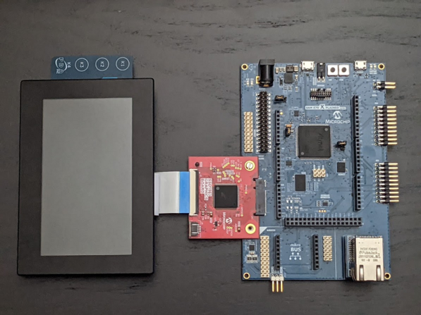
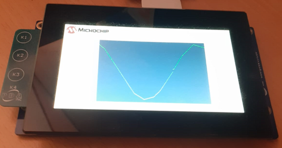

# Building and Running the Application on SAM E70 Xplained Ultra Evaluation Kit

**Downloading and building the application**

Path of the application within the repository is **apps/hello_world/firmware**

To build the application, refer to the following table and open the project in MPLAB X IDE

| Project Name      | Board Configuration  |
|:------------------|:---------------------|
| sam_e70_xult_tm4301b_ssd1963.X    | [ SAM E70 Xplained Ultra Evaluation Kit](https://www.microchip.com/en-us/development-tool/DM320113) with [SSD1963 LCD Controller Graphics Card](https://www.microchip.com/en-us/development-tool/AC320214) driving [High-Performance WQVGA Display Module with maXTouch® Technology](https://www.microchip.com/DevelopmentTools/ProductDetails/PartNO/AC320005-4)|

**Setting up the hardware**
- Setup hardware to drive the WQVGA display using SSD1963 external graphics controller

> 

- Connect the Debug USB port on the board to the computer using a micro USB cable.

**Running the Application**

- Build and Program the application 

- Sin wave is displayed as shown below

> 

