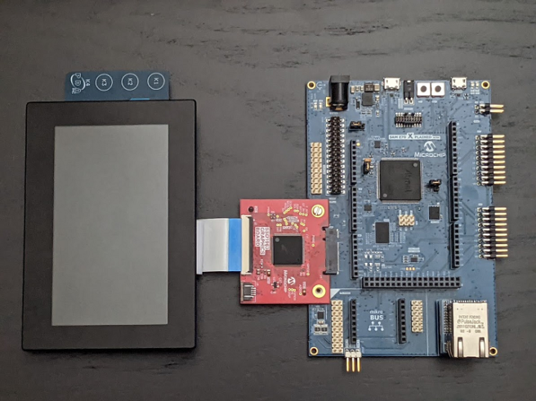
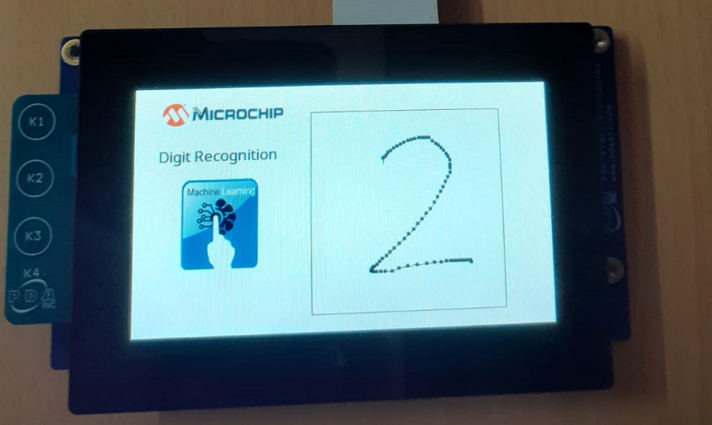

# Building and Running the Application on SAM E70 Xplained Ultra Evaluation Kit

**Downloading and building the application**

Path of the application within the repository is **apps/digit_recognition/firmware**

To build the application, refer to the following table and open the project in MPLAB X IDE

| Project Name      | Board Configuration  |
|:------------------|:---------------------|
| sam_e70_xult_tm4301b_ssd1963.X    | [ SAM E70 Xplained Ultra Evaluation Kit](https://www.microchip.com/en-us/development-tool/DM320113) with [SSD1963 LCD Controller Graphics Card](https://www.microchip.com/en-us/development-tool/AC320214) driving [High-Performance WQVGA Display Module with maXTouch® Technology](https://www.microchip.com/DevelopmentTools/ProductDetails/PartNO/AC320005-4)|

**Setting up the hardware**
- Setup hardware to drive the WQVGA display using SSD1963 external graphics controller

> 

- Connect the Debug USB port on the board to the computer using a micro USB cable.

**Running the Application**

- Open the Terminal application (Ex.:Tera term) on the computer

- Connect to the EDBG Virtual COM port and configure the serial settings as follows:
    - Baud : 115200
    - Data : 8 Bits
    - Parity : None
    - Stop : 1 Bit
    - Flow Control : None

- Build and Program the application

- Write a digit (0 to 9) on the display as shown below

> 

- Recognised digit is displayed as shown below

> 

- The array of scores corresponding to the 10 classes are displayed in the terminal. The highest scores, 2 in this case, will be displayed as the predicted digit.

> 

