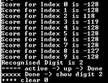

# Building and Running the Application on SAM A5D2 Xplained Ultra

**Downloading and building the application**

Path of the application within the repository is **apps/digit\_recognition/firmware**

To build the application, refer to the following table and open the project using its IDE.

|Project Name|Board Configuration|
|------------|-------------------|
|sam\_a5d2\_xult\_tm5000.X|[SAM A5D2 Xplained Ultra](https://www.microchip.com/Developmenttools/ProductDetails/ATSAMA5D2C-XULT) with [High-Performance WVGA Display Module with maXTouch® Technology](https://www.microchip.com/DevelopmentTools/ProductDetails/PartNO/AC320005-5)|

**Setting up the hardware**

-   Take an SD Card formatted with FAT32 file system, and copy the boot.bin binary file from this location. Also copy the harmony.bin file you generated from the "Building the Application" section.

-   Connect the ribbon cable from the display to the LCD connector on the SAM A5D2 Xplained Ultra board.

> 

-   Insert the SD card to J19 of the SAM A5D2 Xplained Ultra board

-   Connect the Debug USB port \(J14\) on the board to the computer using a micro USB cable.

**Running the Application**

-   Open the Terminal application \(Ex.:Tera term\) on the computer

-   Connect to the EDBG Virtual COM port and configure the serial settings as follows:

    -   Baud : 115200

    -   Data : 8 Bits

    -   Parity : None

    -   Stop : 1 Bit

    -   Flow Control : None

-   Build and Program the application

-   Write a digit \(0 to 9\) on the display and the Recognised digit is displayed as shown below

> 

-   The array of scores corresponding to the 10 classes are displayed in the terminal. The highest scores, 2 in this case, will be displayed as the predicted digit.

> 

**Parent topic:**[Digit Recognition example](GUID-CA8858A6-EC72-42D5-8A59-8B9794E16C66.md)

