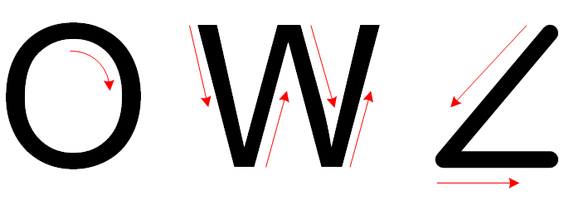

# **Magic Wand** example

This is ["magic wand"](https://github.com/tensorflow/tflite-micro/tree/main/tensorflow/lite/micro/examples/magic_wand) demo of TensorFlow Lite. This example shows how to run neural network model using Tensorflow Lite for microcontroller runtime engine to recognize the "ring", "wing", and "slop" gestures with an accelerometer.

> 

**Development Kits**

The following list provides links to documentation on how to build and run the demo on different development kits

-   **[Building and Running the Application on SAM E70 Xplained Ultra Evaluation Kit](GUID-18F432ED-65E7-4A5B-A662-1BA75CF70D3C.md)**  

-   **[Building and Running the Application on SAM E54 Curiosity Ultra Development Board](GUID-DF0BF0FD-784B-48A8-9C86-58CCD0F15E41.md)**  

**Parent topic:**[MPLAB® Harmony TensorFlow Lite Configurations and Application examples for Microchip Microcontrollers](GUID-64C4C60D-2C4B-4E01-BCC9-D6E17F16F1DE.md)

