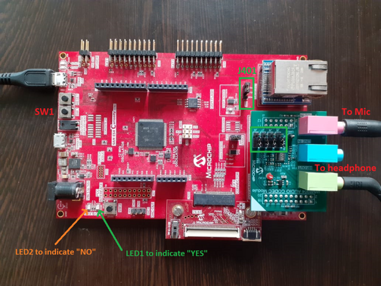
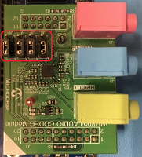
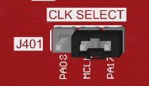

# Building and Running the Application on SAM E54 Curiosity Ultra Development Board

**Downloading and building the application**

Path of the application within the repository is **apps/micro_speech/firmware**

To build the application, refer to the following table and open the project using its IDE.

| Project Name      | Board Configuration  |
|:------------------|:---------------------|
| sam_e54_cult_wm8904_freertos.X    | [SAM E54 Curiosity Ultra Development Board](https://www.microchip.com/en-us/development-tool/DM320210) with [PIC32 Audio Codec Daughter Card with WM8904 stereo codec](https://www.microchip.com/en-us/development-tool/AC328904) |

**Setting up the hardware**

- Hardware is setup as shown below

> 

- Plugin Audio codec daugter board into the set of X32 connectors

- Set the jumpers on the audio codec board as shown below. Each jumper should be connected to the two left-most pins on the board when viewed from the perspective of the audio jack

> 

- Set the CLK SELECT jumper (J401) so that it connects the MCLK and PA17 pins on the board as shown below. This pin configuration lets the WM8904 act as the clock master to the SAME54’s I2S peripheral.

> 

- Connect headphones to the green HP OUT jack of the Codec Daughter Board. 

- Connect your microphone to pink MIC IN jack of the Codec Daughter Board.

> 

- Connect the Debug USB port on the board to the computer using a micro USB cable.

**Running the Application**

- Open the Terminal application (Ex.:Tera term) on the computer

- Connect to the EDBG Virtual COM port and configure the serial settings as follows:
    - Baud : 115200
    - Data : 8 Bits
    - Parity : None
    - Stop : 1 Bit
    - Flow Control : None

- Build and Program the application 

- Press Switch (SW1) to cycle through four volume levels (one muted)

- The LEDs will light up selectively based on which keyword is detected.
 
| Event     | LED indication  |
|:------------------|:---------------------|
| “YES” keyword detected   | LED1 is turned on for 4 seconds|
| “NO” keyword detected   | LED2 is turned on for 4 seconds|

- The score corresponding to four classes are displayed on the terminal. The highest scores, "Yes" in this case, is the detected keyword.

> 

