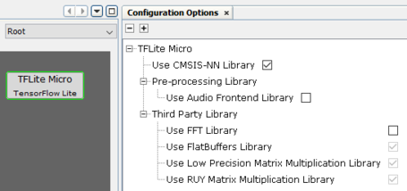

# MPLAB® Harmony TensorFlow Lite Configurations and Application examples for Microchip Microcontrollers

This distribution package contains scripts to represent [TensorFlow Lite for Microcontrollers](https://github.com/tensorflow/tflite-micro) as a component for easier configuration and example applications to demonstrate the usage as part of Harmony framwork.

[Google Colaboratory](https://github.com/Microchip-MPLAB-Harmony/tflite/scripts/digit_recognition/Digit_Recognition.ipynb) notebook is provided to create Convolutional Neural Network \(CNN\) and train with [MNIST dataset](http://yann.lecun.com/exdb/mnist/) to classify handwritten digit. Refer to **Digit Recognition** example application for more details.

**Introduction**

[TensorFlow](https://github.com/tensorflow/tensorflow) is an end-to-end open-source platform for machine learning. Tensorflow bundles together Machine Learning and Deep Learning models and algorithms. TensorFlow can be used for both network training and inference, whereas TensorFlow Lite for Microcontroller \(TFLM\) is specifically designed to deploy a pre-trained deep learning model on embedded devices with limited compute and memory resources.

The process of creating and deploying machine learning model on Microcontroller using TFLM is given below

1.  Select and train a model using TensorFlow.

2.  Convert the model to TensorFlow Lite format using TensorFlow Lite Converter

3.  Deploy the converted model for inferencing on Microcontrollers with TFLM run time engine

> 

[TensorFlow Lite converter](https://www.tensorflow.org/lite/convert/) takes a TensorFlow model and generates a TensorFlow Lite model \(an optimized FlatBuffer format identified by the .tflite file extension\). You can quantize the model to reduce model size and improve execution performance. Refer to [post-training quantization](https://www.tensorflow.org/lite/performance/post_training_quantization) for more details.

Google Colab or "Colaboratory", allows you to write and execute Python in your browser to create models and evaluate these models.

Refer to the following information to get started with TensorFlow and Google Colaboratory.

-   [Welcome to Colaboratory](https://colab.research.google.com/notebooks/welcome.ipynb)

-   [TensorFlow 2 quickstart for beginners](https://www.tensorflow.org/tutorials/quickstart/beginner)

**TensorFlow Lite for Microcontroller \(TFLM\) Configurations**

The following figure shows the configuration option for TFLM component

> 

-   [Use CMSIS-NN Library](https://github.com/ARM-software/CMSIS_5/tree/develop/CMSIS/NN)

> CMSIS-NN provides optimized kernels to maximize the performance and minimize the memory for Cortex-M4 and Cortex-M7 based Microcontrollers. TensorFlow Lite uses optimized kernels \(integer\) when available. The reference kernels \(float\) are used as the fallback option.

-   [Use Audio Frontend Library](https://github.com/tensorflow/tflite-micro/tree/main/tensorflow/lite/experimental/microfrontend)

> This is required to run the micro\_speech example with TFLM

-   [Use FFT library](https://github.com/mborgerding/kissfft)

> This is required to run the micro\_speech example with TFLM

-   TFLM makes use of following third-party library

-   > [FlatBuffers library](https://github.com/google/flatbuffers)

-   > [Low Precision Matrix Multiplication library](https://github.com/google/gemmlowp)

-   > [RUY Matrix Multiplication Library](https://github.com/google/ruy)

**Application examples**

The following applications are provided to demonstrate the typical or interesting usage models for TensorFlow Lite

|Name|Description|
|----|-----------|
|Digit Recognition|Demonstrates handwritten digit recognition|
|hello world|Demonstrate the absolute basics of using TensorFlow Lite for Microcontroller|
|magic wand|Demonstrates how to use accelerometer to recognize gestures|
|micro speech|Demonstrates how to recognize keywords from speech data|

-   **[Digit Recognition example](GUID-CA8858A6-EC72-42D5-8A59-8B9794E16C66.md)**  

-   **[Hello World example](GUID-22D72BA8-E33F-48CE-8AD7-9D5B4221D2A1.md)**  

-   **[Magic Wand example](GUID-1A54C1AF-D42B-4750-A5F2-C8E1CC52E767.md)**  

-   **[Micro Speech example](GUID-85C71EF8-14CC-4BC7-814C-1248E7D2D6B6.md)**  

