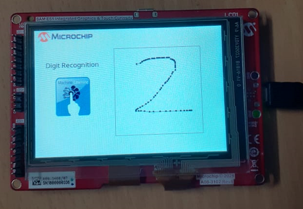
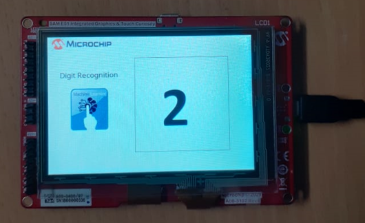

# Building and Running the Application on SAM E51 Integrated Graphics and Touch Development Board

**Downloading and building the application**

Path of the application within the repository is **apps/digit\_recognition/firmware**

To build the application, refer to the following table and open the project using its IDE.

|Project Name|Board Configuration|
|------------|-------------------|
|sam\_e51\_igat.X|[SAM E51 Integrated Graphics and Touch Development Board](https://www.microchip.com/developmenttools/ProductDetails/EV14C17A)|

**Setting up the hardware**

-   Connect the Debug USB port on the board to the computer using a micro USB cable.

**Running the Application**

-   Open the Terminal application \(Ex.:Tera term\) on the computer

-   Connect to the EDBG Virtual COM port and configure the serial settings as follows:

    -   Baud : 115200

    -   Data : 8 Bits

    -   Parity : None

    -   Stop : 1 Bit

    -   Flow Control : None

-   Build and Program the application

-   Write a digit \(0 to 9\) on the display as shown below

> 

-   Recognised digit is displayed as shown below

> 

-   The array of scores corresponding to the 10 classes are displayed in the terminal. The highest scores, 2 in this case, will be displayed as the predicted digit.

> 

**Parent topic:**[Digit Recognition example](GUID-CA8858A6-EC72-42D5-8A59-8B9794E16C66.md)

