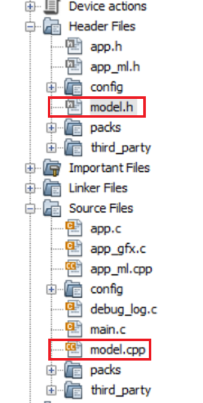

# **Digit Recognition** example

This example demonstrates handwritten digit recognition using TensorFlow Lite for Microchip 32-bit Microcontrollers. The neural network model is created and trained with MNIST dataset to classify a given image of handwritten digit into one of 10 classses \(0-9\).

[Google Colaboratory](https://github.com/Microchip-MPLAB-Harmony/tflite/scripts/digit_recognition/Digit_Recognition.ipynb) notebook is provided to create Convolutional Neural Network \(CNN\) and train with [MNIST dataset](http://yann.lecun.com/exdb/mnist/) to classify handwritten digit.

-   Open the notebook in google Colab

-   Press ctrl+F9 or go to runtime menu on top and click run all option and all cells run at a time.

-   Generated model is converted to TensorFlow Lite FlatBuffer format \(**model\_int8\_full.tflite**\) with **full integer quantization** to reduce model size and improve execution performance.

-   The easiest way to use a model in your project is to include it as a C array. Hence, the flatbuffer is converted to C array \(**"model\_int8\_full.cpp"** and **"model\_int8\_full.h"**\)

> 

-   MPLAB X project includes the generated model file to perform inferencing on Microcontroller using TFLM runtime engine

> 

**Development Kits**

The following list provides links to documentation on how to build and run the demo on different development kits

-   **[Building and Running the Application on SAM E70 Xplained Ultra Evaluation Kit](GUID-0F3CD544-58EB-44C0-BB29-1A012E01C1B1.md)**  

-   **[Building and Running the Application on SAM E51 Integrated Graphics and Touch Development Board](GUID-984FB84C-4725-4AA2-A70C-A884D01311AB.md)**  

-   **[Building and Running the Application on SAM A5D2 Xplained Ultra](GUID-1073FCEB-AA0D-4DED-B13C-728191CCA55B.md)**  

**Parent topic:**[MPLAB® Harmony TensorFlow Lite Configurations and Application examples for Microchip Microcontrollers](GUID-64C4C60D-2C4B-4E01-BCC9-D6E17F16F1DE.md)

