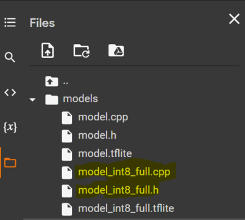

# **Digit Recognition** example

This example demonstrates handwritten digit recognition using TensorFlow Lite for Microchip 32-bit Microcontrollers. 
The neural network model is created and trained with MNIST dataset to classify a given image of 
handwritten digit into one of 10 classses (0-9). 

[Google Colaboratory](https://github.com/Microchip-MPLAB-Harmony/tflite/scripts/digit_recognition/Digit_Recognition.ipynb) notebook is provided 
to create Convolutional Neural Network (CNN) and train with [MNIST dataset](http://yann.lecun.com/exdb/mnist/) to classify handwritten digit. 

- Open the notebook in google Colab 
- Press ctrl+F9 or go to runtime menu on top and click run all option and all cells run at a time. 
- Generated model is converted to TensorFlow Lite FlatBuffer format (**model_int8_full.tflite**) with **full integer quantization** to reduce model size and improve execution performance. 
- The easiest way to use a model in your project is to include it as a C array. Hence, the flatbuffer is converted to C array (**"model_int8_full.cpp"** and **"model_int8_full.h"**)
> 
- MPLAB X project includes the generated model file to perform inferencing on Microcontroller using TFLM runtime engine 
> 

**Development Kits**

The following list provides links to documentation on how to build and run the demo on different development kits