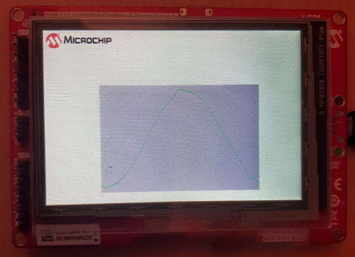

# Building and Running the Application SAM E51 Integrated Graphics and Touch Development Board

**Downloading and building the application**

Path of the application within the repository is **apps/hello\_world/firmware**

To build the application, refer to the following table and open the project using its IDE.

|Project Name|Board Configuration|
|------------|-------------------|
|sam\_e51\_igat.X|[SAM E51 Integrated Graphics and Touch Development Board](https://www.microchip.com/developmenttools/ProductDetails/EV14C17A)|

**Setting up the hardware**

-   Connect the Debug USB port on the board to the computer using a micro USB cable.

**Running the Application**

-   Build and Program the application

-   Sin wave is displayed as shown below

> 

**Parent topic:**[Hello World example](GUID-22D72BA8-E33F-48CE-8AD7-9D5B4221D2A1.md)

