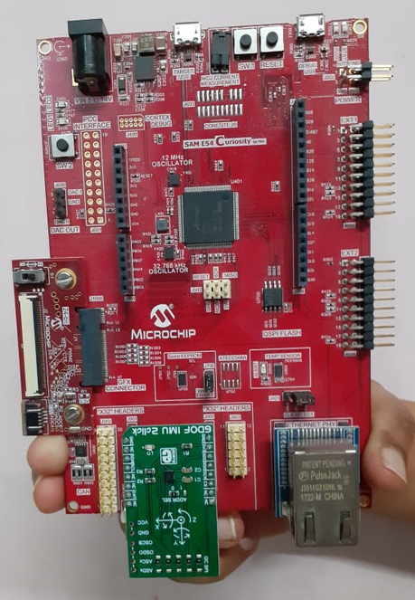
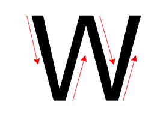
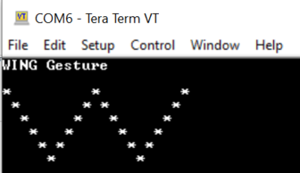

# Building and Running the Application on SAM E54 Curiosity Ultra Development Board

**Downloading and building the application**

Path of the application within the repository is **apps/magic\_wand/firmware**

To build the application, refer to the following table and open the project using its IDE.

|Project Name|Board Configuration|
|------------|-------------------|
|sam\_e54\_cult\_imu2.X|[SAM E54 Curiosity Ultra Development Board](https://www.microchip.com/en-us/development-tool/DM320210) with [6DOF IMU 2 Click](https://www.mikroe.com/6dof-imu-2-click)|

**Setting up the hardware**

-   Plug an IMU 2 Click board into the MikroBus socket

-   Connect the Debug USB port on the board to the computer using a micro USB cable.

**Running the Application**

-   Open the Terminal application \(Ex.:Tera term\) on the computer

-   Connect to the EDBG Virtual COM port and configure the serial settings as follows:

    -   Baud : 115200

    -   Data : 8 Bits

    -   Parity : None

    -   Stop : 1 Bit

    -   Flow Control : None

-   Build and Program the application

-   Hold the board as shown below. Proper board orientation is required to infer the gestures correctly.

> 

-   Perform the wing gesture.

> 

-   The detected gesture is displayed on the terminal

> 

**Parent topic:**[Magic Wand example](GUID-1A54C1AF-D42B-4750-A5F2-C8E1CC52E767.md)

