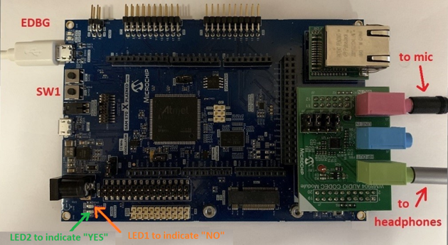
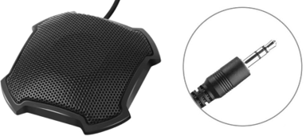
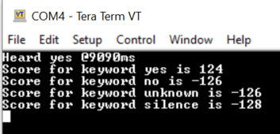

# Building and Running the Application on SAM E70 Xplained Ultra Evaluation Kit

**Downloading and building the application**

Path of the application within the repository is **apps/micro\_speech/firmware**

To build the application, refer to the following table and open the project in MPLAB X IDE

|Project Name|Board Configuration|
|------------|-------------------|
|sam\_e70\_xult\_wm8904\_i2sc\_freertos.X|[SAM E70 Xplained Ultra Evaluation Kit](https://www.microchip.com/en-us/development-tool/DM320113) with [PIC32 Audio Codec Daughter Card with WM8904 stereo codec](https://www.microchip.com/en-us/development-tool/AC328904)|

**Setting up the hardware**

-   Hardware is setup as shown below

> 

-   Plugin Audio codec daugter board into the set of X32 connectors

-   Set the jumpers on the audio codec board as shown below. Each jumper should be connected to the two right-most pins on the board when viewed from the perspective of the audio jack

> 

-   Connect headphones to the green HP OUT jack of the Codec Daughter Board.

-   Connect your microphone to pink MIC IN jack of the Codec Daughter Board.

> 

-   Connect the Debug USB port on the board to the computer using a micro USB cable.

**Running the Application**

-   Open the Terminal application \(Ex.:Tera term\) on the computer

-   Connect to the EDBG Virtual COM port and configure the serial settings as follows:

    -   Baud : 115200

    -   Data : 8 Bits

    -   Parity : None

    -   Stop : 1 Bit

    -   Flow Control : None

-   Build and Program the application

-   Press Switch \(SW1\) to cycles through four volume levels \(one muted\)

-   The LEDs will light up selectively based on which keyword is detected. \| Event \| LED indication \| \|:------------------\|:---------------------\| \| “YES” keyword detected \| LED2 is turned on for 4 seconds\| \| “NO” keyword detected \| LED1 is turned on for 4 seconds\|

-   The score corresponding to four classes are displayed on the terminal. The highest scores, "Yes" in this case, is the detected keyword.

> 

**Parent topic:**[Micro Speech example](GUID-85C71EF8-14CC-4BC7-814C-1248E7D2D6B6.md)

